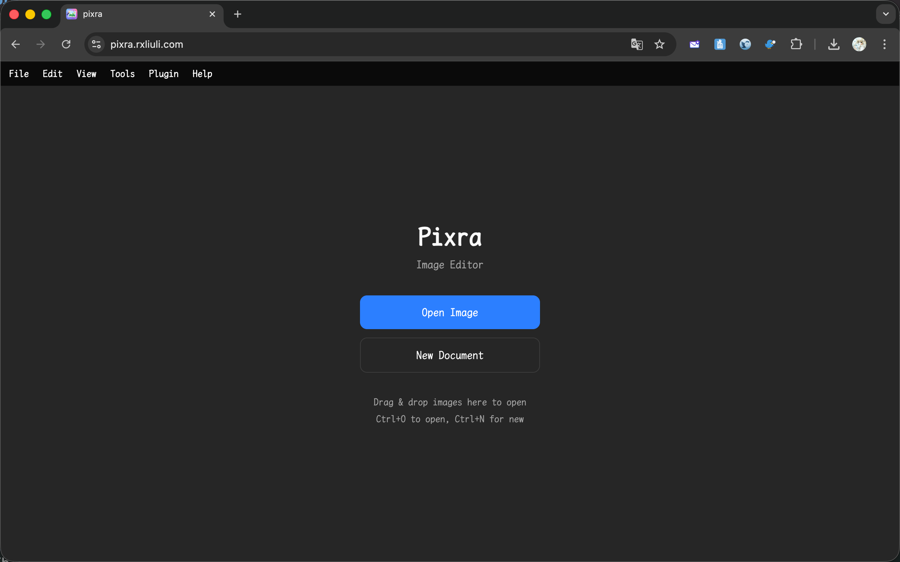
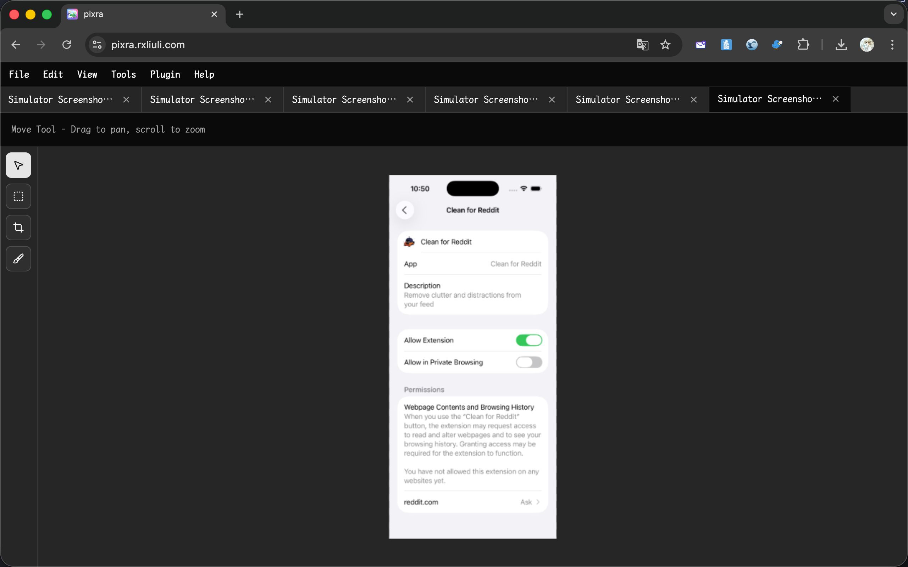
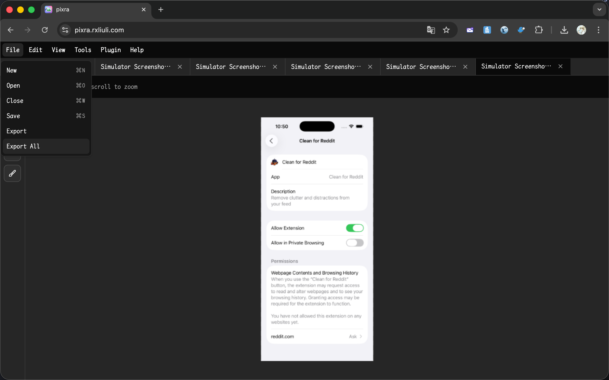
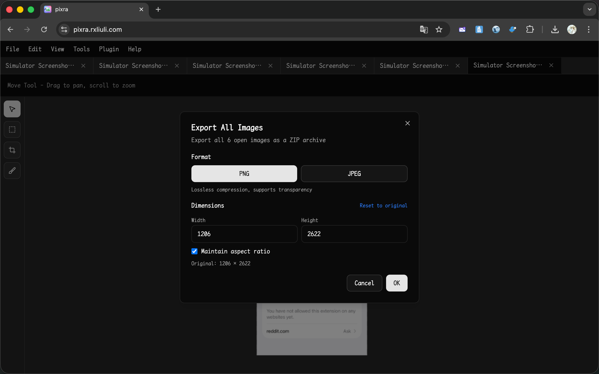
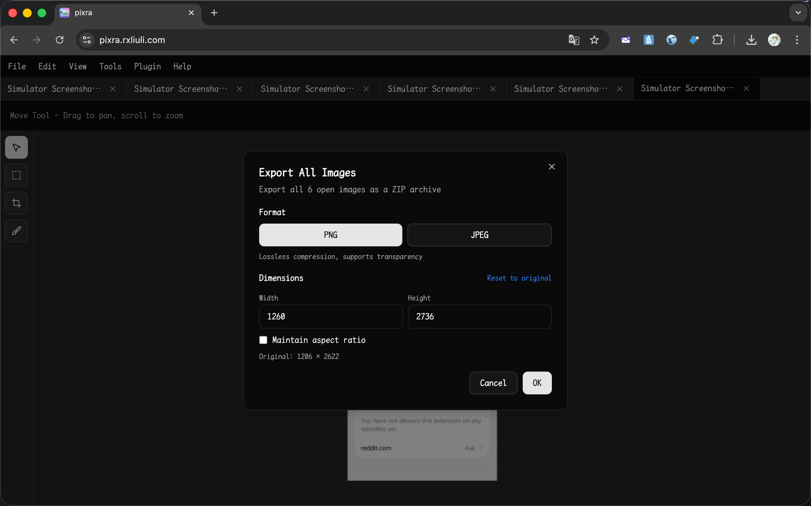
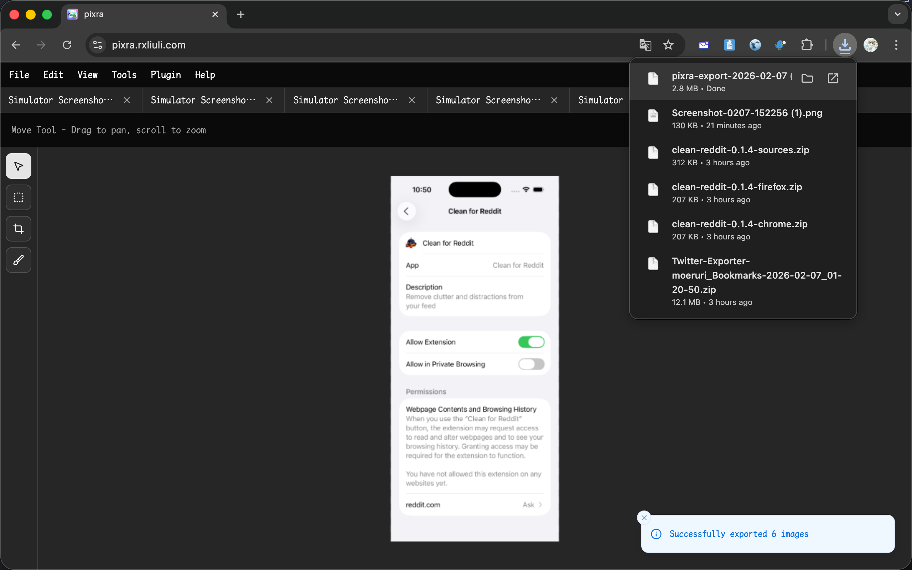
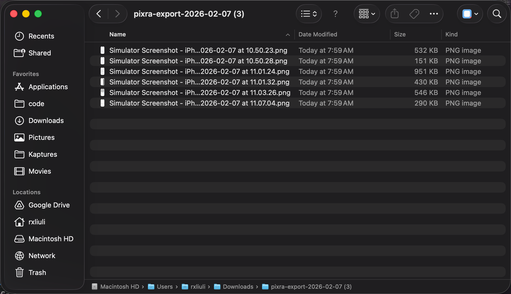

import { YouTube } from 'astro-embed'

<YouTube id="5kJQCtByiZs" />

When submitting an app to the App Store, Apple requires screenshots in exact dimensions for each device type. If you're using an iOS Simulator, the screenshots you capture may not match the required sizes. Manually resizing dozens of screenshots one by one is tedious and error-prone.

In this tutorial, I'll show you how to use [Pixra](https://pixra.rxliuli.com/) to batch convert multiple images to a specific size in just a few clicks — using iOS Simulator screenshots as a practical example.

## App Store Screenshot Requirements

Apple requires screenshots in specific pixel dimensions depending on the device:

| Device      | Required Size |
| ----------- | ------------- |
| iPhone 6.9" | 1260 x 2736   |
| iPhone 6.5" | 1284 x 2778   |
| iPhone 6.3" | 1179 x 2556   |
| iPhone 5.5" | 1242 x 2208   |
| iPad 13"    | 2064 x 2752   |
| iPad 11"    | 1488 x 2266   |

Screenshots taken from the iOS Simulator may differ slightly in size, so you need to resize them to match exactly.

## Step 1: Open Pixra

Navigate to [https://pixra.rxliuli.com/](https://pixra.rxliuli.com/) in your browser. No installation is required — Pixra runs entirely in your browser.

## Step 2: Open All Your Screenshots

Click **File > Open** or press `Ctrl+O` (Windows/Linux) / `Cmd+O` (macOS). In the file picker, select all the screenshots you want to convert. You can select multiple files at once.

Each image will open in a separate tab within Pixra.

## Step 3: Export All with Target Dimensions

1. Click **File > Export All** or run the `Export All` command from the Command Palette (`Ctrl+Shift+P` / `Cmd+Shift+P`)

2. An export dialog will appear with the default dimensions of the first image

3. Enter the required **Width** and **Height** for your target device (e.g., 1260 x 2736 for iPhone 6.9")
4. Uncheck **Maintain aspect ratio** if your source and target aspect ratios differ slightly
5. Choose your preferred **Format** (PNG is recommended for App Store screenshots)

## Step 4: Download the ZIP

Click **OK** to start the export. Pixra will:

1. Resize each image to the target dimensions
2. Package all images into a single ZIP file
3. Automatically download the ZIP to your computer

A progress indicator will show the export status for each image.

## Step 5: Upload to App Store Connect

Extract the downloaded ZIP file. All your screenshots are now at the exact dimensions required by the App Store. Upload them directly to [App Store Connect](https://appstoreconnect.apple.com/).

## Tips

- **Multiple device sizes**: Repeat the process for each device size you need. Open the same set of screenshots, change the target dimensions, and export again.
- **Format choice**: Use PNG for lossless quality. Use JPEG if you need smaller file sizes and don't need transparency.
- **Aspect ratio**: If your source screenshots have a slightly different aspect ratio than the target, unchecking "Maintain aspect ratio" will stretch the image to fit exactly. In most cases, iOS Simulator screenshots are close enough that this is not noticeable.

## Summary

With Pixra's Export All feature, you can batch convert any number of images to a specific size in seconds:

1. Open all images in Pixra
2. Use **File > Export All**
3. Set the target dimensions
4. Download the ZIP

This workflow isn't limited to App Store screenshots — you can use it anytime you need to resize a batch of images to uniform dimensions.

## Related Links

- [Pixra](https://pixra.rxliuli.com/) - The web-based image editor
- [Getting Started](/docs/guides/getting-started/) - Learn the basics of Pixra
- [App Store Screenshot Specifications](https://developer.apple.com/help/app-store-connect/reference/screenshot-specifications/) - Apple's official screenshot requirements
