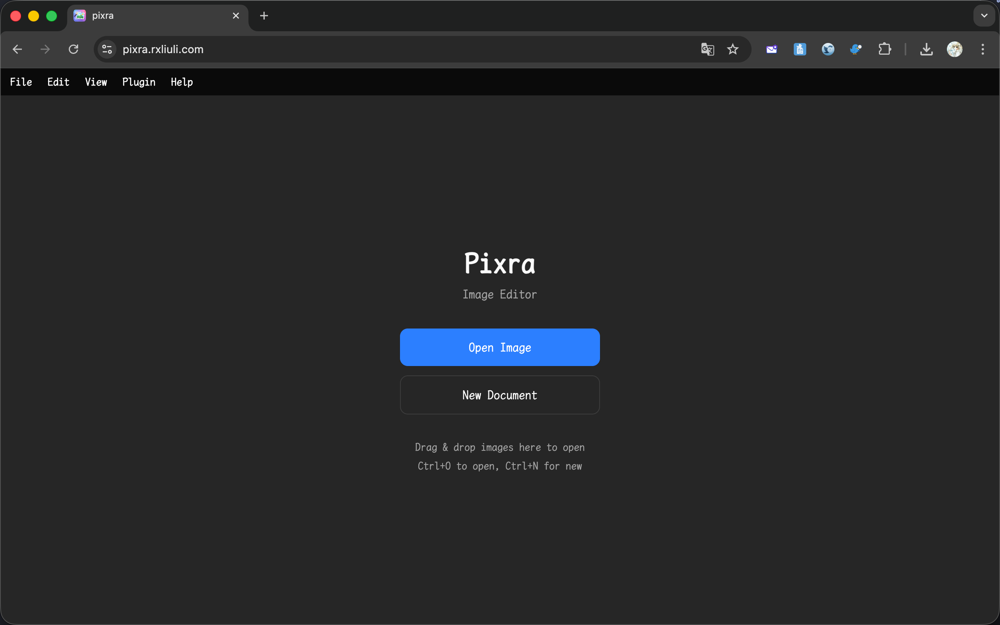
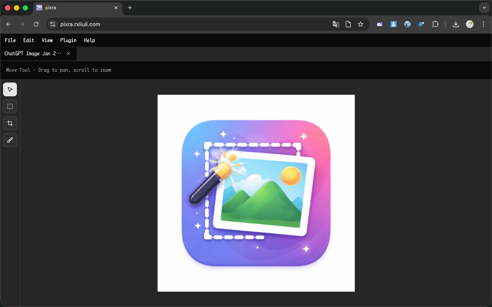
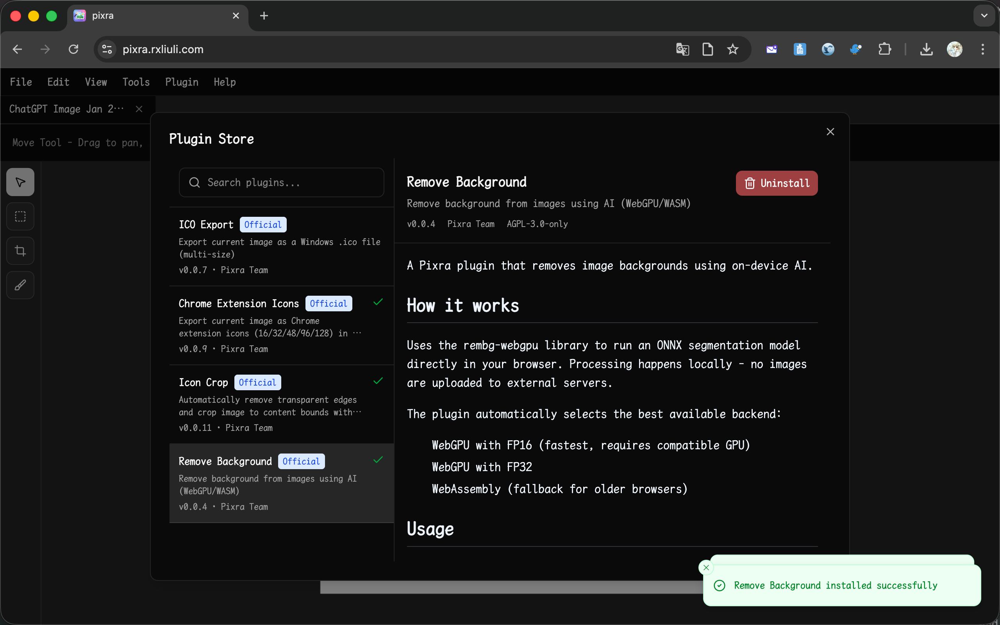
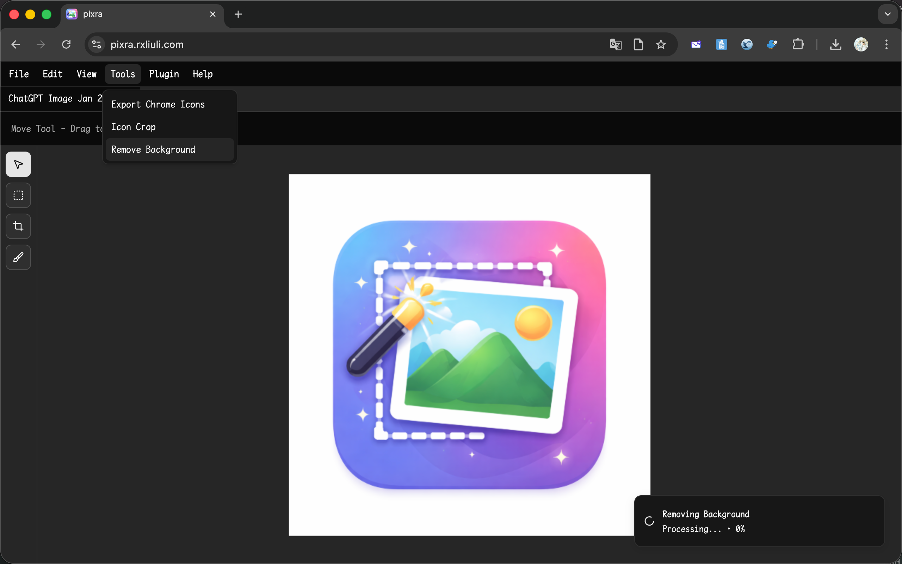
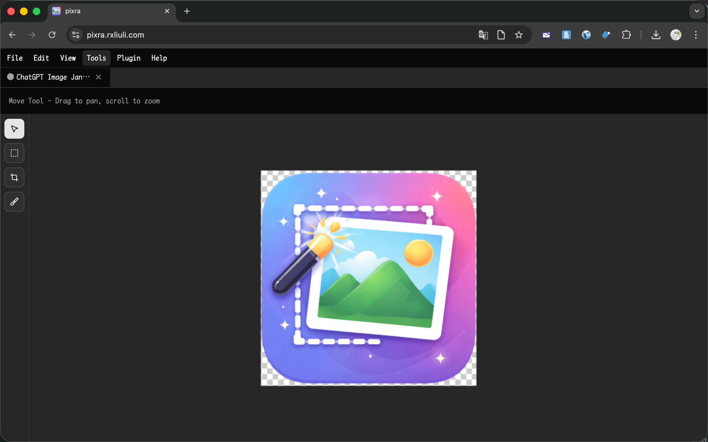
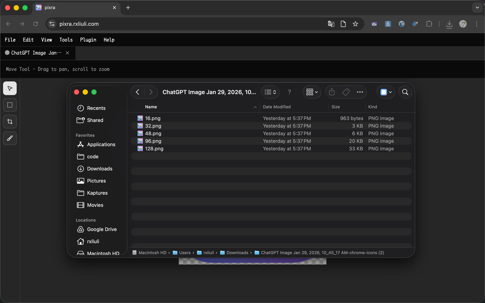

import { YouTube } from 'astro-embed';

<YouTube id="Oqi4aycvfAk" />

AI image generators like Midjourney, DALL-E, and Stable Diffusion make it easy to create beautiful icons for your projects. However, Chrome extensions require icons in multiple sizes (16x16, 32x32, 48x48, 96x96, 128x128), and AI-generated images often come with backgrounds and extra padding that need to be removed.

In this tutorial, I'll show you how to use [Pixra](https://pixra.rxliuli.com/) to quickly process AI-generated icons into production-ready Chrome extension icons.

## What You'll Need

- An AI-generated icon image (PNG, JPEG, or WebP)
- A web browser (Chrome, Firefox, Edge, or Safari)

## Step 1: Open Pixra

Navigate to [https://pixra.rxliuli.com/](https://pixra.rxliuli.com/) in your browser.



## Step 2: Open Your AI-Generated Icon

Click **File > Open** or press `Ctrl+O` (Windows/Linux) or `Cmd+O` (macOS) to open your AI-generated icon file.



## Step 3: Install Required Plugins

Pixra uses a plugin system for extended functionality. We need three plugins for this workflow:

1. Click **Plugin > Plugin Store** to open the plugin store
2. Install the following plugins:
   - **Remove Background** - Removes the background from images using AI
   - **Icon Crop** - Automatically crops to the icon content, removing extra padding
   - **Chrome Extension Icons** - Exports icons in all sizes required by Chrome extensions



## Step 4: Remove the Background

1. Click **Tools > Remove Background**
2. The first time you use this tool, it will download an AI model (~80MB). Please wait for the download to complete.
3. Once processed, the background will be removed, leaving only your icon with a transparent background.




> **Tip**: The background removal uses an on-device AI model, so your images never leave your browser.

## Step 5: Crop to Icon Content

AI-generated images often have significant padding around the actual icon. The Icon Crop tool removes this automatically.

1. Click **Tools > Icon Crop**
2. The tool will detect the icon boundaries and crop to fit



## Step 6: Export Chrome Extension Icons

Now we're ready to export the icon in all the sizes Chrome needs.

1. Click **Tools > Export Chrome Icons**
2. A ZIP file will automatically download containing:
   - `16.png` (16x16)
   - `32.png` (32x32)
   - `48.png` (48x48)
   - `96.png` (96x96)
   - `128.png` (128x128)



## Step 7: Add Icons to Your Extension

1. Extract the downloaded ZIP file
2. Copy the icon files to your Chrome extension project
3. Update your `manifest.json` to reference the icons:

```json
{
  "icons": {
    "16": "16.png",
    "32": "32.png",
    "48": "48.png",
    "96": "96.png",
    "128": "128.png"
  },
  "action": {
    "default_icon": {
      "16": "16.png",
      "32": "32.png",
      "48": "48.png",
      "96": "96.png",
      "128": "128.png"
    }
  }
}
```

## Summary

With Pixra and its plugins, you can quickly transform AI-generated images into properly formatted Chrome extension icons in just a few clicks:

1. Open your image in Pixra
2. Install the required plugins (one-time setup)
3. Remove the background
4. Crop to content
5. Export Chrome icons
6. Add to your extension project

The entire process takes less than a minute once you have the plugins installed. Give it a try with your next Chrome extension project!

## Related Links

- [Pixra](https://pixra.rxliuli.com/) - The web-based image editor
- [Using Plugins](/docs/guides/using-plugins/) - Learn more about Pixra plugins
- [Chrome Extension Icons Documentation](https://developer.chrome.com/docs/extensions/mv3/manifest/icons/) - Official Chrome documentation on extension icons
