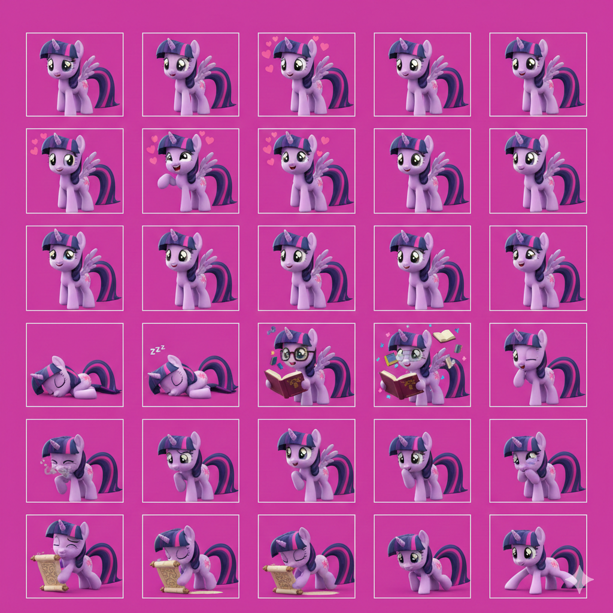
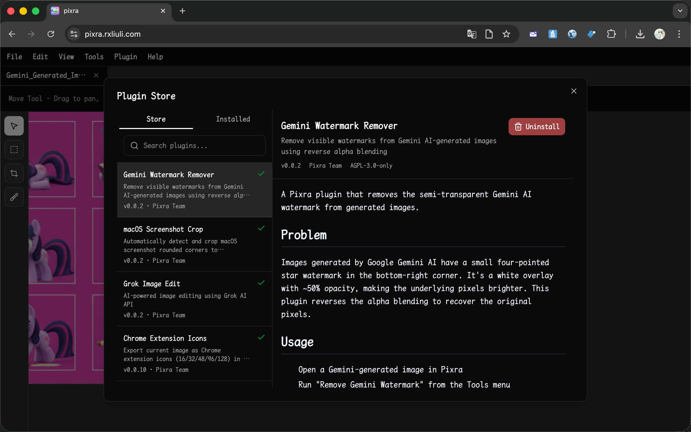
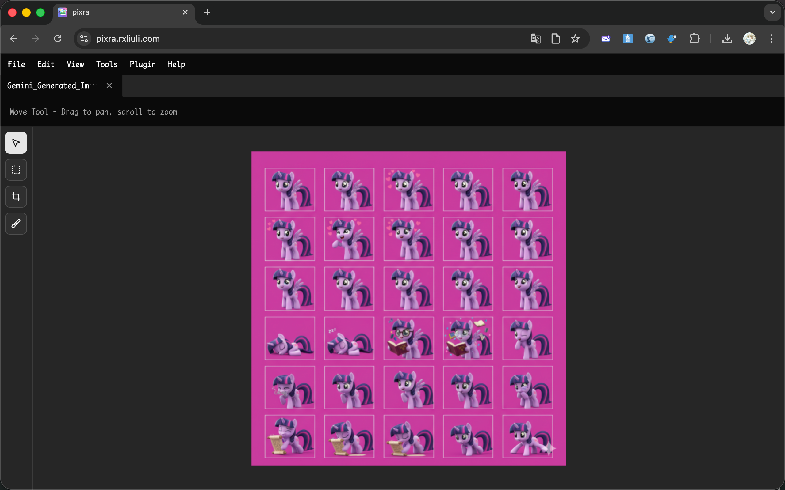
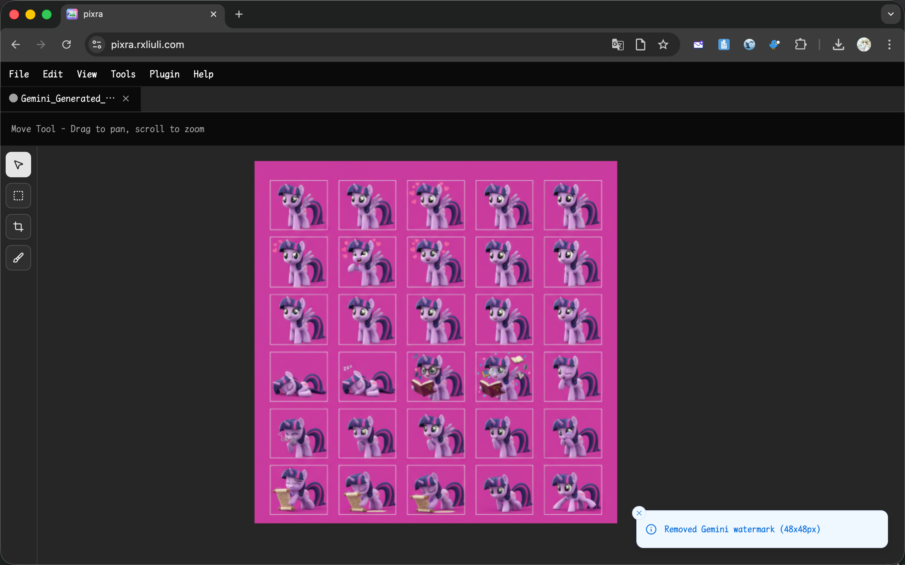

import { YouTube } from 'astro-embed';

<YouTube id="-0lhVPlPafU" />

Google Gemini AI adds a small semi-transparent four-pointed star watermark to the bottom-right corner of every generated image. This plugin removes it by reversing the alpha blending, recovering the original pixels underneath.

## The Problem

Every image generated by Gemini has a white star watermark overlaid at ~50% opacity. It's subtle but visible, and can be distracting when using the images in designs or presentations.

## Solution

The Gemini Watermark Remover plugin uses a pre-extracted alpha map of the watermark shape and reverses the blending formula to recover the original pixel values — no inpainting or AI required, just math.

## Usage

### Step 1: Install the Plugin

1. Open [Pixra](https://pixra.rxliuli.com/)
2. Go to **Plugin > Plugin Store**
3. Install **Gemini Watermark Remover**

### Step 2: Open Your Image

Open your Gemini-generated image in Pixra using **File > Open** or drag and drop.

### Step 3: Remove the Watermark

Click **Tools > Remove Gemini Watermark**. The watermark area is restored instantly.

### Step 4: Export

Export the result via **File > Export**.

## How It Works

The watermark is white (255, 255, 255) with a fixed alpha (~0.5). The plugin:

1. Determines the watermark size based on image dimensions (48x48 or 96x96)
2. Locates it at a fixed offset from the bottom-right corner
3. Applies reverse alpha blending: `original = (current - 255 × α) / (1 - α)`

The recovery error is typically less than 3/255 per channel.

## Related Links

- [Pixra](https://pixra.rxliuli.com/)
- [Using Plugins](/docs/guides/using-plugins/)
