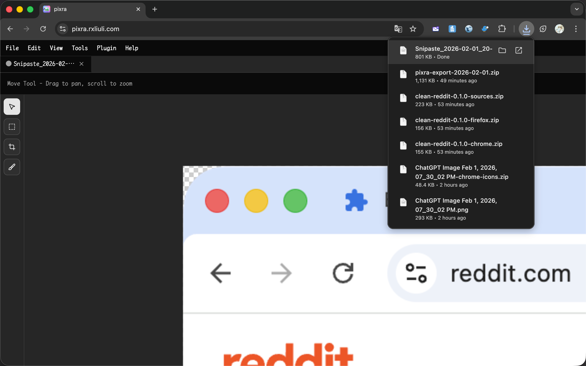

import { YouTube } from 'astro-embed';

<YouTube id="3nrbbgPSJe8" />

When you take a screenshot of a window on macOS, the four corners capture whatever is behind the window, creating unwanted artifacts. This plugin automatically detects the corner radius and makes those areas transparent.

## The Problem

macOS windows have rounded corners. When you capture a window screenshot, the corners include the background content, which looks unprofessional in documentation or presentations.

## Solution

The macOS Screenshot Crop plugin for Pixra solves this by:

1. Detecting the window border color along the image edges
2. Calculating the corner radius
3. Applying a circular mask to make the corners transparent

## Usage

### Step 1: Install the Plugin

1. Open [Pixra](https://pixra.rxliuli.com/)
2. Go to **Plugin > Plugin Store**
3. Install **macOS Screenshot Crop**

### Step 2: Open Your Screenshot

Open your macOS window screenshot in Pixra using **File > Open** or drag and drop.

### Step 3: Run the Plugin

Click **Tools > macOS Screenshot Crop**. The plugin will automatically detect and process all four corners.

### Step 4: Export

Export as PNG to preserve the transparency: **File > Export > PNG**.

## Limitations

- Works best when the window border color differs from the background
- The detected radius may be slightly larger than the actual corner radius in some cases
- Designed for standard macOS window screenshots

## Related Links

- [Pixra](https://pixra.rxliuli.com/)
- [Using Plugins](/docs/guides/using-plugins/)
